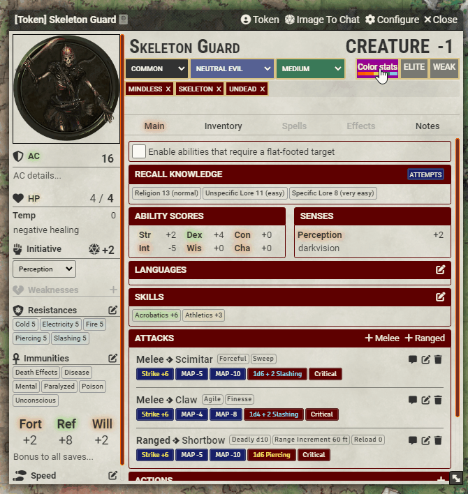
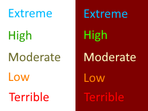
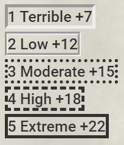

# [pF2e See Simple Scale Statistics](https://foundryvtt.com/packages/pf2e-see-simple-scale-statistics/)

FoundryVTT module for the PF2e system, which allows the GM to see where creatures' stats lie on the Terrible-Low-Moderate-High-Extreme scale.

To install, browse for it in the module browser,
or [directly copy the manifest link for the latest release](https://github.com/itamarcu/pf2e-see-simple-scale-statistics/releases/latest/download/module.json)
.

## Features
Click the new button on the top right of each NPC character sheet to toggle the mod's functionality (setting is client-side and global for all sheets).

Each important statistic of the creature will be recolored to indicate where it lies on a simple scale!

## Use cases (for the GM)
- When a player uses Recall Knowledge and you want to tell them about well-known stats, or about whether a particular stat is high or low.
- When you want to quickly grasp roughly how a creature is meant to be played (brute, sniper, etc), at a glance
- When you're homebrewing or altering a creature - you want to avoid having too many extreme stats. 

## Supported stats
All stats mentioned in [Building Creatures](https://2e.aonprd.com/Rules.aspx?ID=995) are supported.
However, special features like Regeneration or Sneak Attack aren't taken into account.

- AC
- HP
- Perception
- Saves: Fortitude, Reflex, Will
- Abilities: Strength, Dexterity, Constitution, Intelligence, Wisdom, Charisma
- Resistances and Weaknesses (**note**: colors are flipped for weaknesses, because it's a negative attribute to have)
- Strikes (for each attack): Attack bonus and average damage (**note**: this does not take any traits or other features into account)
- Spellcasting (for each spellcasting ability): Attack bonus and DC

## Colors

Colors are cyan (Extreme), green (High), yellow (Moderate), orange (Low), and red (Terrible).

## Borders

To improve accessibility for color-blind folks, there's also a setting to use borders.

Border scale is: solid (Extreme), dashed (High), dotted (Moderate), groove (Low), and inset (Terrible).

## Where is the scale taken from?
[Building Creatures](https://2e.aonprd.com/Rules.aspx?ID=995), from the official Pathfinder 2e rules.

Note that I added my own definition of "Terrible" for some scales that were missing explicit values, defining it as the Low value reduced by its difference to the Moderate value and further decreased by 1.
It feels pretty good, but technically it's not the same as the official definition.  I don't have a PhD in terribleness.

Also note that there's a special setting to treat resistance/weakness to "all"/"physical" as double its value, which I find useful
as a way to quickly understand when a creature has one of them.

